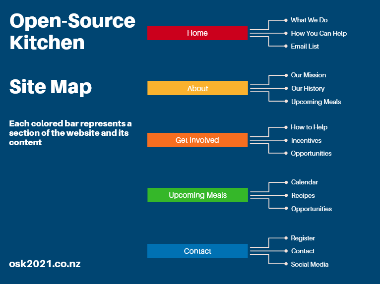

# MILESTONE ONE

> ### WEBSITE BRIEF
 
> #### CHARITY NAME : OPEN SOURCE KITCHENS

> ##### The members of the Open-Source Kitchens are interested in having a website of their own. The following is a brief description of the proposed website:

Open-Source Kitchens is a “community style” kitchen in the Nelson region that offer meals prepared by the local community to the local community. 

We need a website for the Nelson region for members of the charity to spread information and acquire support from the community. The website lets users register and make donations in the form of their time, money, or physical goods. The website will also provide important upcoming event information.

Members will be given tokens after successful donations, and a certain number of tokens will allow members to act in more important kitchen roles, to help design the weeks menu, or to act as an administrator.

We require the following features on the website:

- 1. Kitchen members and beneficiaries can register, log in and administer their own accounts.
- 2. Members use the website to register their donations and collect tokens
- 3. Interactive element(s) that engages the website user.
- 4. The system provides an interface for the members to accept and view their donations via tokens.

> ### WEBSITE REQUIREMENTS

- #### WEBSITE GOALS
The purpose of this website is to act as a organizational hub for our open-source kitchen. Our short term goal is to quickly increase membership, while our long term goal is to create a sustainable volunteer based kitchen that will help ensure that no one in our community does not have access to a healthy meal. The main audience for the website is anyone that is committed to helping and feeding our community in a social and equitable environment. Our hope is that a few well intentioned members of the community will immediately find value in our mission, join, and then help us build outward and gain more membership.

- #### USER EXPERIENCE
The overall user experience should be extremely simple and almost automated for the user. This will ensure that users aren't discouraged from helping just because they can not navigate the website. The first type of audience that our website should be catered to is the individual interested in volunteering to better their community. This is a broad audience, so an emphasis should be made on quickly and simply presenting the individual with information that details how much they can impact the community by donating to our open-source kitchen. Our secondary target audience should be anyone that struggles with food security. It is important to present to this audience in a way that shows them how the open-source kitchen can benefit them and their famil, while at the same time letting them also contribute to the community.

> ##### SCENARIOS
The ideal user scenario is that a potential user views our website with the desire to volunteer in the community. They would immediately be presented with the vital information about how their cooperation with the open-source kitchen will impact their community in a positive way. They should then be able to register and supply ideal conditions for them to donate time, money, skills, or goods. After registering, the user should receive an automated email with further details about membership, tokens, and the open-source kitchen itself.

Another ideal scenario is that an individual or family is referred to the website in order to help them with food security. They should easily be able to view meal schedules and conditions for dining at the open-source kitchen. They would also need to register and supply ideal conditions for them to contribute. After registering, the user should receive an automated email with further details about membership, tokens, and the open-source kitchen itself.

A third scenario is that someone hears about the open-source kitchen and visits the website to gather more information. They should be able to easily navigate and find the benefits of the kitchen, as well as how an individual can join and contribute. 

Each of these scenarios, as different as they are, should be considered and used to help create an easy to navigate UI and site map that effortlessly guides the user to their desired point of interest. It is important to present a universal source of information to avoid the feeling of social stratification when a user comes to the website to help or seeking help. An impression of commonality and togetherness should applied to all sections, and the desired information should be accessible without noticeably having to navigate into specified 'give help' or 'need help' sections. Doing this will ensure the user does not feel as if the open source kitchen is charity, but in actuality is an opportunity for everyone.

- #### WEBSITE CONTENT
Since the open-source kitchen is a fairly unique concept, there are not a lot of competing websites to compare and contrast with. The inspiration for the open-source kitchen is World Central Kitchen, a non-profit travelling kitchen that goes to communities and provides meals for those struggling with food security. Most notably they travel to areas suffering from natural disasters, areas with refugees of conflict, or poverty stricken areas. 

The most noteable features of the [World Central Kitchen](https://wck.org/) is the bold navigation links at top, and the important links immediately displayed on the hero image. This is probably the most important feature as it easily allows any user to immediately locate the exact information they are looking for. Beyond this, the overall style and use of colors and images present a very friendly and easily understood website. The World Central Kitchen website will be a reference point when further designing our open-source kitchen website.

> ##### SITE MAP

- #### WEBSITE STRUCTURE

> ### USER STORIES
> ### CRUD
