# MILESTONE ONE

> ### WEBSITE BRIEF
 
> #### CHARITY NAME : OPEN SOURCE KITCHENS


> ##### The members of the Open-Source Kitchens are interested in having a website of their own. The following is a brief description of the proposed website:

Open-Source Kitchens is a “community-style” kitchen in the Nelson region that offers meals prepared by the local community to the local community. 

We need a website for the Nelson region for members of the charity to spread information and acquire support from the community. The website lets users register and make donations in the form of their time, money, or physical goods. The website will also provide important upcoming event information.

Members will be given tokens after successful donations, and a certain number of tokens will allow members to act in more important kitchen roles, to help design the week's menu, or to act as an administrator.

> ### WEBSITE REQUIREMENTS

We require the following features on the website:

- 1. Kitchen members and beneficiaries can register, login, and administer their accounts.
- 2. Members use the website to register their donations and collect tokens
- 3. Interactive element(s) that engages the website user.
- 4. The system provides an interface for the members to accept and view their donations via tokens.


- #### WEBSITE GOALS
The purpose of this website is to act as an organizational hub for our open-source kitchen. Our short-term goal is to quickly increase membership, while our long-term goal is to create a sustainable volunteer-based kitchen that will help ensure that no one in our community does not have access to a healthy meal. The main audience for the website is anyone that is committed to helping and feeding our community in a social and equitable environment. We hope that a few well-intentioned members of the community will immediately find value in our mission, join, and then help us build outward and gain more membership.

- #### USER EXPERIENCE
The overall user experience should be extremely simple and almost automated for the user. This will ensure that users aren't discouraged from helping just because they can not navigate the website. The first type of audience that our website should be catered to is the individual interested in volunteering to better their community. This is a broad audience, so an emphasis should be made on quickly and simply presenting the individual with information that details how much they can impact the community by donating to our open-source kitchen. Our secondary target audience should be anyone that struggles with food security. It is important to present to this audience in a way that shows them how the open-source kitchen can benefit them and their family, while at the same time letting them also contribute to the community.

> ##### SCENARIOS
The ideal user scenario is that a potential user views our website with the desire to volunteer in the community. They would immediately be presented with vital information about how their cooperation with the open-source kitchen will positively impact their community. They should then be able to register and supply ideal conditions for them to donate time, money, skills, or goods. After registering, the user should receive an automated email with further details about membership, tokens, and the open-source kitchen itself.

Another ideal scenario is that an individual or family is referred to the website to help them with food security. They should easily be able to view meal schedules and conditions for dining at the open-source kitchen. They would also need to register and supply ideal conditions for them to contribute. After registering, the user should receive an automated email with further details about membership, tokens, and the open-source kitchen itself.

A third scenario is that someone hears about the open-source kitchen and visits the website to gather more information. They should be able to easily navigate and find the benefits of the kitchen, as well as how an individual can join and contribute. 

Each of these scenarios, as different as they are, should be considered and used to help create an easy-to-navigate UI and site map that effortlessly guides the user to their desired point of interest. It is important to present a universal source of information to avoid the feeling of social stratification when a user comes to the website to help or seeking help. An impression of commonality and togetherness should be applied to all sections, and the desired information should be accessible without noticeably having to navigate into specified 'give help' or 'need help' sections. Doing this will ensure the user does not feel as if the open-source kitchen is charity, but in actuality is an opportunity for everyone.

- #### WEBSITE CONTENT
Since the open-source kitchen is a fairly unique concept, there are not a lot of competing websites to compare and contrast with. The inspiration for the open-source kitchen is World Central Kitchen, a non-profit traveling kitchen that goes to communities and provides meals for those struggling with food security. Most notably they travel to areas suffering from natural disasters, areas with refugees of conflict, or poverty-stricken areas. 

The most notable features of the [World Central Kitchen](https://wck.org/) are the bold navigation links at the top, and the important links immediately displayed on the hero image. This is probably the most important feature as it easily allows any user to immediately locate the exact information they are looking for. Beyond this, the overall style and use of colors and images present a very friendly and easily understood website. The World Central Kitchen website will be a reference point when further designing our open-source kitchen website.

> ##### SITE MAP
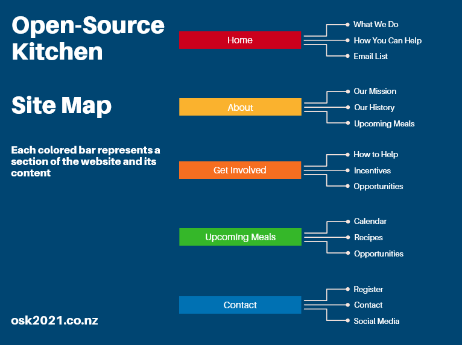

- #### WEBSITE STRUCTURE

I created a general template that will be used for the entire website. This will make sure that website maintenance and usability will be simple and direct. Each Page, represented by colored bars in the site map above, will contain no more than three elements. The header, the main section, and a footer.

The header will be the first thing a user sees and will have quick navigation access to the most important aspects of that page. A unique background image and header will also be designated to each page's header.

The main section will contain the content outlined in the site map, also a maximum of only three elements will be allowed within a page's main section. This helps to make sure the page does not become cluttered. When possible, less than three elements should be contained within a page's main section.

The footer will remain consistent on all pages. It will contain information regarding existing kitchens, email subscription details, as well as email and social media links.

The mockups shown below are first drafts and multiple modifications will occur during the development process. Most notably, fonts, spacing, and element alignment will all be adjusted to create a more uniform and fluid design.

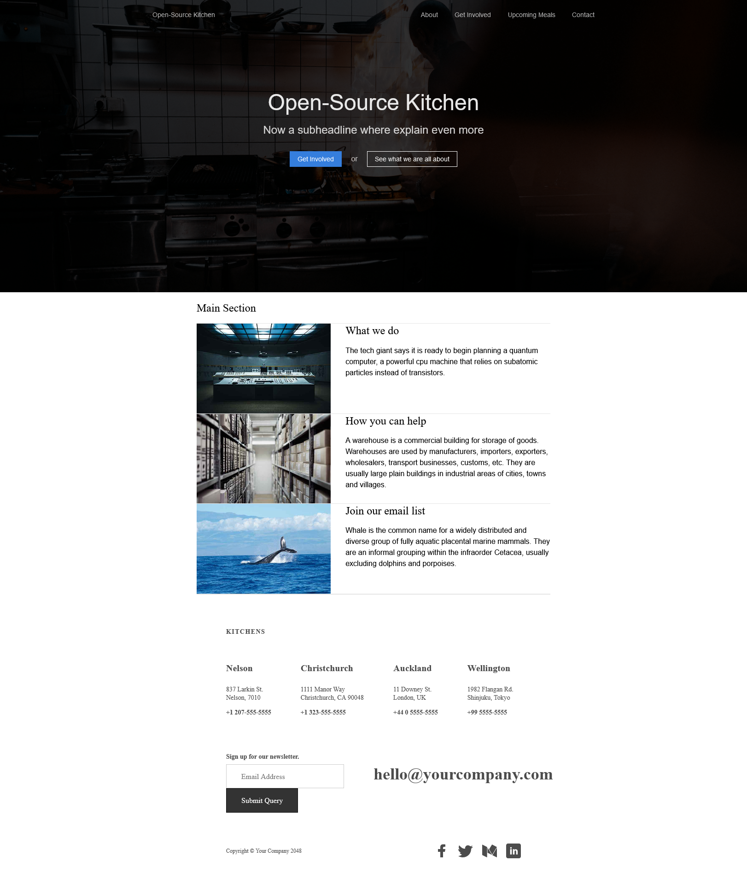

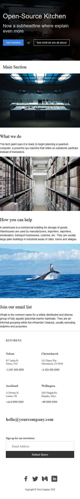

> ### USER STORIES
- As a guest, I want to be able to view information to help me better understand this organization.
- As a guest, I want to be able to sign up for email notifications about future events.
- As a guest, I want to be able to register as a member and acquire more information about what a member does
- As a member, I want to quickly access information about my responsobilities.
- As a member, I want to sign up to donate my time, skills, goods, and/or money.
- As a member, I want to view my past participation and accumalation of tokens.
- As a member, I want to exchange my tokens for more responsibility or for a meal.
- As a member, I want to delete my information or entire account. 
> ### CRUD

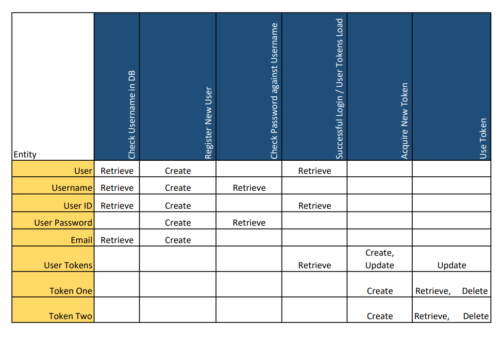

> ### API BOILERPLATE

[ExpressJs Generator](https://expressjs.com/en/starter/generator.html#express-application-generator) has been used to generate [boilerplate API code](../ms1/files/server/app.js). It will be modified and updated as the project continues.

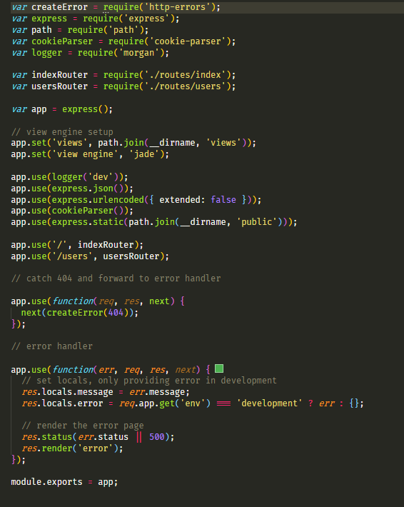


=================================================================== 

# Milestone 2 Evaluate

## Framework Purpose

Front-end frameworks are packages containing standardized code that makes the development of a UI much more effecient and slightly simplified at the same time. Modern web development has a wide variety of frameworks available that serve different purposes. The frameworks discussed in this report concern JavaScript frameworks used to create stable and effecient user-interfaces used on the website.   

### Vue

Vue is an open-source MVVM JavaScript framework. The MVVM pattern used in Vue make it popular for UI development, especially with single-page applications (SPAs). It is often referred to as "the progressive framework" because of the ease in which developers can remove and add features. Vues most unique feature is directives, which are used to manipulate the DOM via HTML attribute bindings.

### Angular

Angular is an open-source MVC TypeScript framework developed by Google in 2010. A major feature of Angular is its use of static typing. Static typing makes sure that errors are caught earlier in the development process by checking them at  compile time, as opposed to dynamic typing which can lead to errors during runtime. 

## Framework Features

### Vue

There are many features in Vue giving it a clear advantage in certain use-cases. The first and most noticeable feature is the file size of Vue. The whole framework is considered very lightweight at just around 20 kilobytes. This means smaller projects can be setup in very little time. Another useful feature is its native CLI. Vues small size combined with a well documented CLI let developers get started with just a simple CLI configuration wizard. This makes developing with Vue very friendly and accessible for developers of all levels. Vue also comes with some community maintained advanced features that help with state management and routing.

### Angular

Angular is feature rich framework that utlises the MVC architecture. The use of MVC architecture is wildly popular amongst developers, especially because of its ability to utilise two-way data binding between the model and view. Another major feature of Angular is that is cross-platform, you can use it to build a UI for pretty much any system. Angular has a very useful and well documented CLI. Many developers prefer the CLI has it helps alleviate some common frustrations with component creation, webpack, and other tedious tasks that allow developers to focus on the right kind of code. Angular has very notable and consistent contributions from Microsoft and Google, giving it strong credibility among developers. 

## INSTALLATION

### Vue

There are a number ways to install or add Vue to a project. There is an [official CLI tool](https://cli.vuejs.org/) that provides a number of useful options when starting a new project. Vue can also be added via CDN, NPM, and downloaded and added directly to the project root. The most effecient way is to use the CLI because it automatically creates the correct project directory and adds template files to create a simple working app upon completion. The CLI has two options to create a new project, either by CLI or by a UI. This project will use the Vue CLI to ensure the creation is simple and direct.

> Vue Cli install command

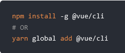

> Vue CLI create command

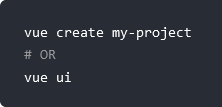


### Angular

An [Angular CLI](https://angular.io/guide/setup-local#install-the-angular-cli) is used to create projects. The installation and use is similar to that of Vue, with some distinct differences regarding the list of possible commands and options available. A majority of an Angualar project, including components and various smaller elements can be generated via CLI. 

> Angular Cli install command

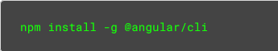

> Angular CLI create command

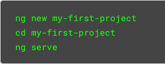

### PROOF OF CONCEPT

Since maneuvering between multiple frameworks can be very difficult, I have looked for solutions to the following tasks that can be used for both frameworks with similiar configurations.

#### REGISTER LOGIN ADMIN

A common solution to registering, logging in, and creating administrative rights is to use a third-party library or service. Having the dedveloper create their own system can be time consuming, and depending on the developer, could lead to lots of buggy elements. For both Vue and Angular, this website will incorporate [Auth0 services](https://auth0.com/). Using Auth0 in combination with the framework will ensure the latest and safest protocols will be used. Auth0 offers free services to small projects, and has a large and demanding enterprise cliental. Using Auth0 will give our project and its users the same security and features that fortune 500 companies use.

Another feature of Auth0 is that it has already established framework specific solutions, so both Vue and Angular have support "out-of-the-box". Auth0 also contains thourough instructions on how to configure features for each framework, as well as a "roles" feature that can distinguish between normal users and admins. Since Auth0 can provide registration, login, and admin services for both Vue and Angular, it is an easy choice for this project.

> Auth0 app create screen

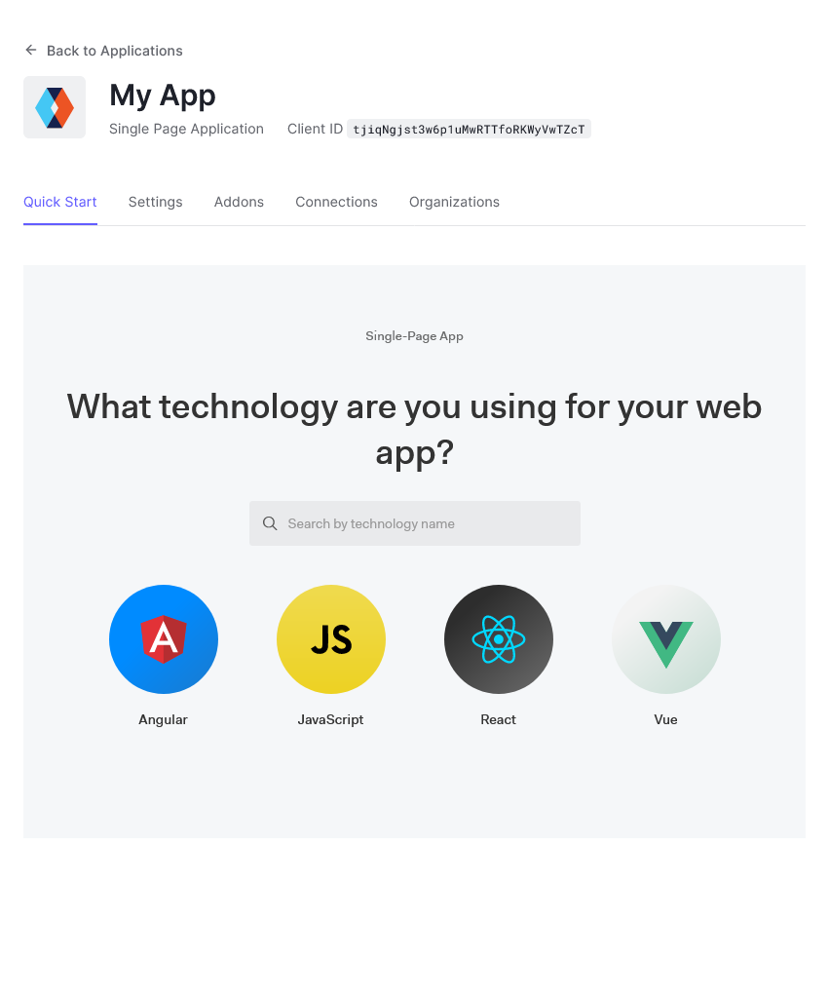

> Auth0 express impliminatation

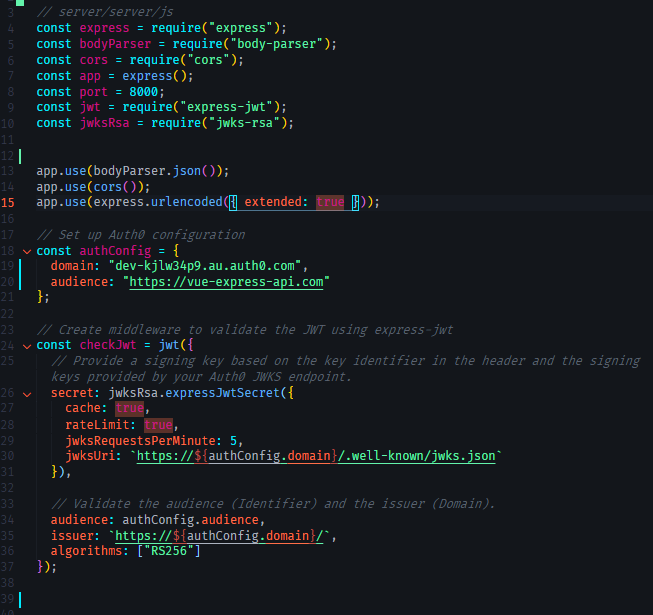

> Auth0 frontend instance verification

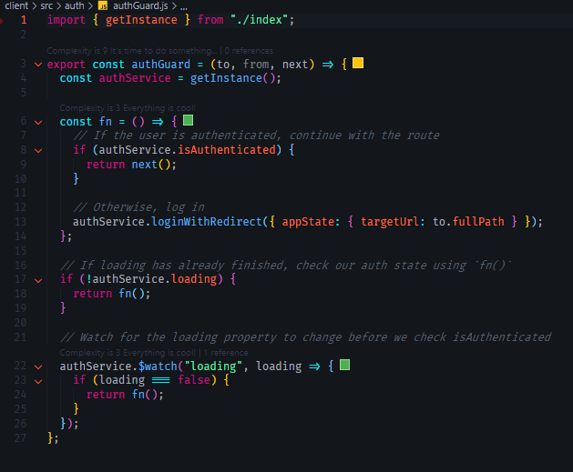

> Auth0 frontend code

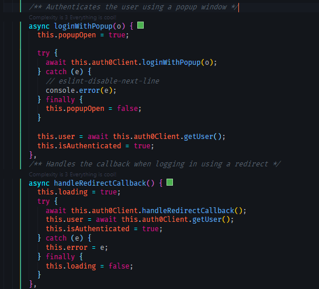

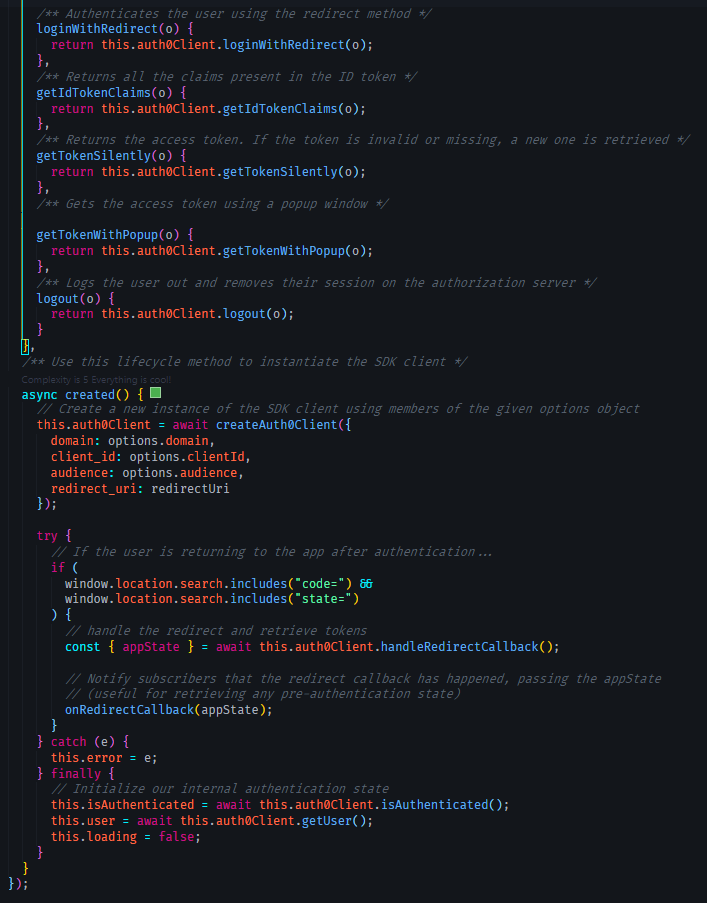


#### TOKEN DISTRIBUTION

Token distribution to users will be done via their user profiles. For each user profile a wallet will be included, this wallet will be used to record the users activity with the Open Source Kitchen. This wallet will be an array that accepts json objects with relavant info regarding the users activity. If the array contains enough objects, aka tokens, then the user can then apply for positions with more responsibilities in the kitchen. 

> User profile schema with wallets

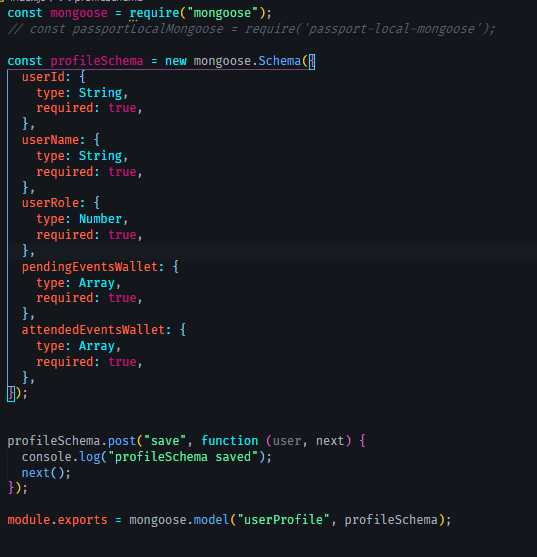

> Token schema

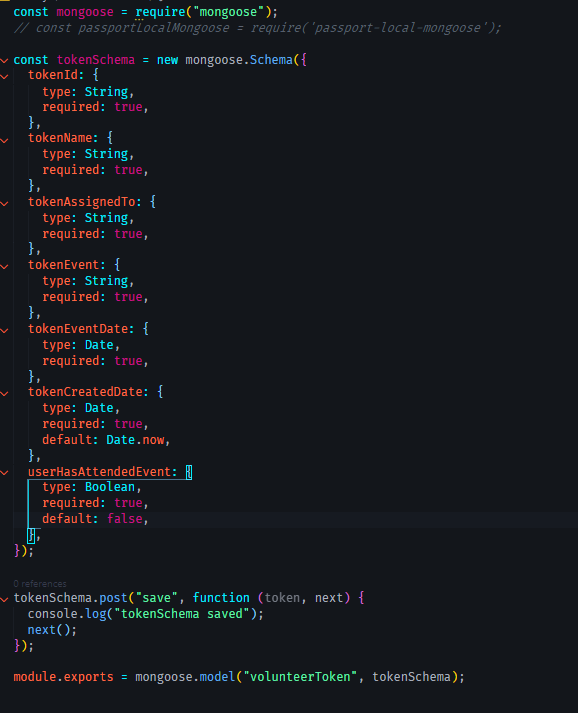

#### INTERACTIVE ELEMENTS

Interactive elements on the website will be limited. An emphasis will be put on clean design and UI simplicity. This will make sure users with different technical abilities will be able to access our services easily. More of a focus should be placed on the website being responsive since a lot of users will access the website via a tablet or mobile device. [The CSS framework Bulma](https://bulma.io/) will be used to make styling and responsive design much easier to implement and will help enforce styling consistency across the project.

#### TOKEN INTERFACE

The token interface will be a button located on an event card that states the user will attend as a volunteer. When the button is pressed, a JSON event specific object will be added to the users profile wallet array. The JSON object will contain a key value pair ``` hasAttended: false ```, after the users attendance at the event is confirmed an admin will update the key value pair to ``` true ```. Since this event is handled via a button click it can be easily implemented the same way in both frameworks. 

A user will also be able to view the contents of their wallet via their profile page. Tokens that have not been confirmed by an admin will be shown in a separate section from the tokens that are confirmed.

> Token interface button

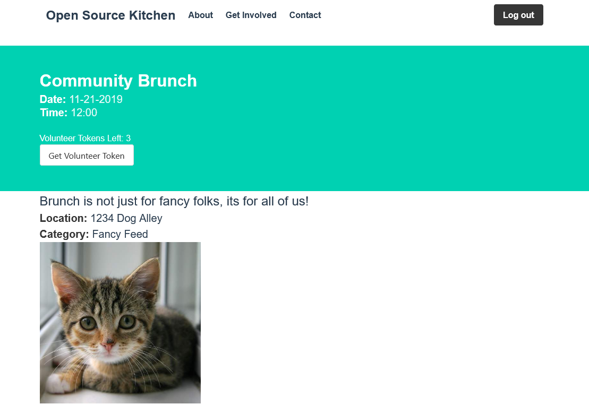

#### SERVER-SIDE API

All MongoDB interactions can be controlled within the Express backend. Both frameworks can essentially "plug and play" with the Express backend. 

> Express and MongoDB code snippet (just basic connection via mongoose)

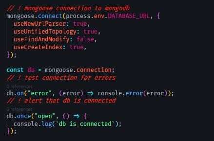

## FINAL RECOMMENDATION

The final recommendation for this project is the framework Vue. It's simple implementation and lightweight are perfect for an SPA(single-page app) like ours. It contains all the basic features the website requires including routing and state management. Vue is well documented and its powerful integration with Auth0 services provide the exact features required to register, login, logout, and support admin roles. The fact that Vue is an open-source community project aligns perfectly with the ideals and mission of the Open Source Kitchen. 


===============================================================  

# MILESTONE THREE

### PART ONE 

> - [register, login, admin](####-REGISTER-LOGIN-ADMIN)
> - [beneficiaries use system to acquire tokens](####-TOKEN-INTERFACE)
> - interactive elements

<!-- screenshots of interactive stuff here -->


> - [store and retrieve data api](####-SERVER-SIDE-API)

### PART TWO

> ##### [Final Source Code](../../app/final)

### PART THREE

> introduction

For this project I have chosen to use [Vue.js](https://v3.vuejs.org/guide/introduction.html) as the UI framework for my Open Source Kitchen website. There are a number of reasons why this framework was chosen, but the main one is that it is a community driven open-source project created and developed by a large developer community. It is considered a progressive framework that is easily adopted incrementally. Vue is great for powering Single-Page Applications, smaller projects, or integrating into other projects with minimal configuration. Many developers prefer Vue for its core system that declaritively renders data to the DOM with a simple and easy to understand template syntax.

>  implementation

My favorite part of Vue is it's native command-line interface, or CLI, that allows an entire projects scaffolding to be created with just a line of terminal code, ```vue create projectName ```. The [Vue CLI](https://cli.vuejs.org/) creates a project directory with customizable support that includes unit testing, TypeScript, Babel, ESLint, and a few other useful tooling to make project setup nearly painless. It is worth noting that the CLI also has a UI available for creating and modifying projects via a GUI, the command to do so is ```vue ui```. 

After the initial project was setup via the CLI, an additional command ``` vue add router ``` can be run to directly install and configure a router boilerplate configuration in the project. 

The next part of the project involved connecting the [Auth0 services](https://auth0.com/) with the project. Most of this process is covered in the [register, login, admin section](####-REGISTER-LOGIN-ADMIN) of Milestone Two. Having industry grade security services with up-to-date documentation specifically for Vue was a massive time saver and gives the project industry-grade security and integrity.

Since the Auth0 services run primarily through the backend, the configuration documentation also helped me create and configure the server used for the project. Some special configuration was needed to establish user roles and permissions that would allow certain users to have the ability to access and modify users. 